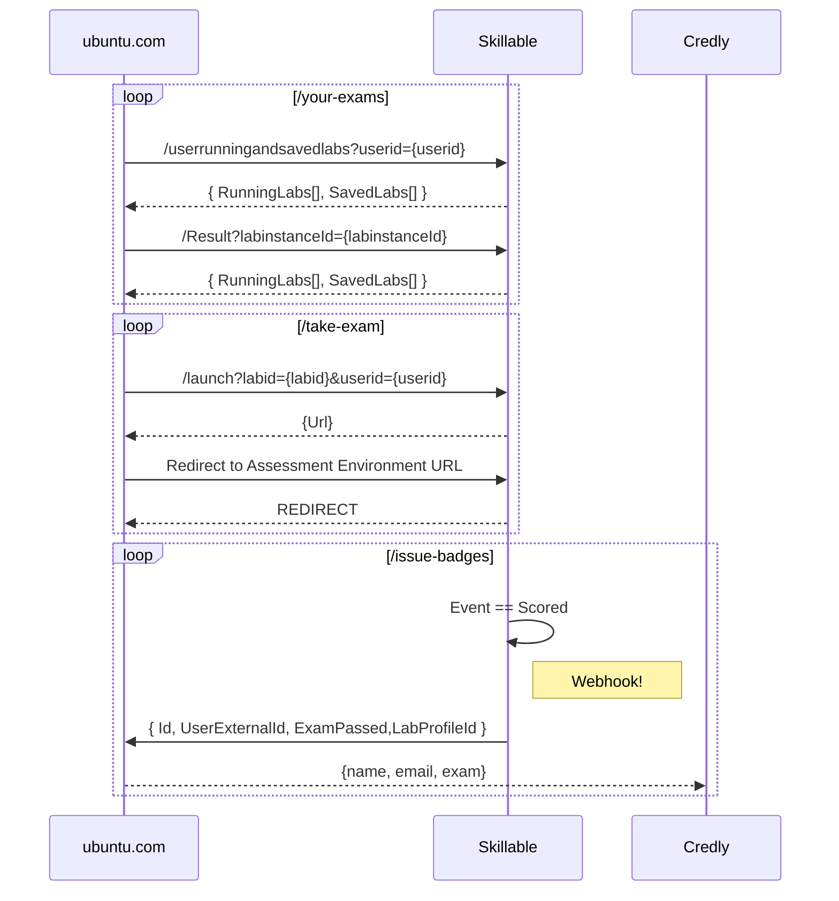

```mermaid
sequenceDiagram
loop /your-exams 
    ubuntu.com->>Skillable: /userrunningandsavedlabs?userid={userid}
    Skillable-->>ubuntu.com: { RunningLabs[], SavedLabs[] }
    ubuntu.com->>Skillable: /Result?labinstanceId={labinstanceId}
    Skillable-->>ubuntu.com: { RunningLabs[], SavedLabs[] }
end
loop /take-exam
    ubuntu.com->>Skillable: /launch?labid={labid}&userid={userid}
    Skillable-->>ubuntu.com: {Url}
    ubuntu.com->>Skillable: Redirect to Assessment Environment URL
    Skillable-->>ubuntu.com: REDIRECT
end
loop /issue-badges
    Skillable->>Skillable: Event == Scored
    Note right of Skillable: Webhook!
    Skillable->>ubuntu.com: { Id, UserExternalId, ExamPassed,LabProfileId }
    ubuntu.com-->>Credly: {name, email, exam}
end
```